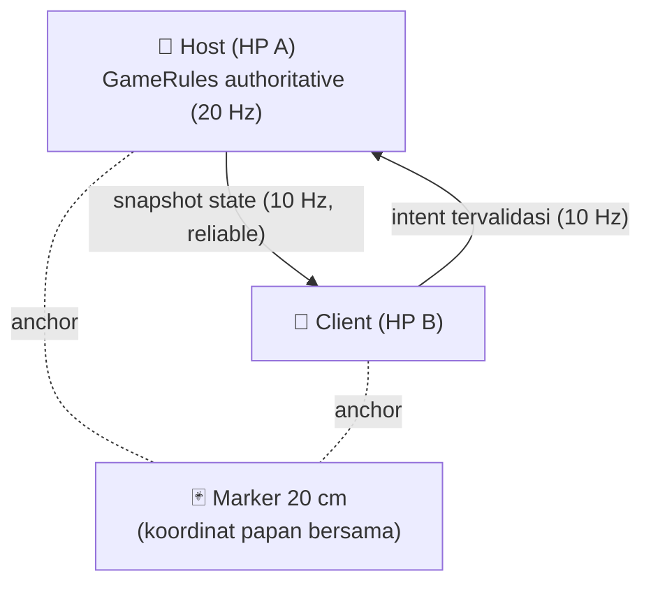

<div align="center">

# 📦 PAKET PANIK

### 🎁 Jaga paketnya. Curi isinya. Salahkan temanmu.

**Dua HP. Satu meja. Satu kardus yang punya gigi.** 👹
Monster paket terlihat oleh kedua pemain lewat kamera AR masing-masing, satu pemain menenangkannya dengan lampu, satu lagi mencuri camilannya. Lampu habis, permen emas menggoda, lalu paketnya bersin. 😱🍬

[](https://unity.com)
[](https://developers.google.com/ar)
[](https://docs-multiplayer.unity3d.com)
[]()
[]()
[]()
[]()

</div>

> ⚠️ **Status jujur:** vertical slice sudah terbangun dan teruji di Editor (kompilasi bersih, 11/11 tes lulus, APK berhasil dibuild). **Uji dua handphone nyata belum dijalankan**, checklistnya ada di [`Evidence/DEVICE-QA-CHECKLIST.md`](Evidence/DEVICE-QA-CHECKLIST.md).
> 📣 **Punya HP Android yang mendukung ARCore? Kami butuh laporan pengujianmu!** Cukup ikuti checklist dan kirim hasilnya lewat issue. 🙏

---

## 📸 Cuplikan

| 🎬 Menu & privasi | 👹 Monster di meja | 🃏 Simulasi AR + marker |
|:-:|:-:|:-:|
|  |  |  |

<p align="center"><i>Semua visual di atas dirender langsung dari kode game, tidak ada file gambar karakter.</i></p>

## ✨ Kenapa proyek ini menarik

- 🎯 **Puzzle sosial asli**: satu jaga, satu ambil, dan kalian harus percaya pada orang yang salah. 😅
- 📸 **AR bersama tanpa Cloud Anchor**: satu kartu marker 20 cm menjadi koordinat papan yang sama untuk dua HP, tanpa server, tanpa akun, tanpa internet.
- 🧠 **Aturan deterministik**: host menghitung 20 tick/detik; klien hanya mengirim intent yang divalidasi secara geometri. Anti-cheat dasar sudah ada.
- 🎨 **Nol aset biner karakter**: monster kardus, permen, efek suara, dan marker seluruhnya digenerate dari kode.
- 🧪 **Test-first gameplay**: 11 tes NUnit mengunci perilaku aturan (quota, baterai, gigitan, lock barang, rematch).
- 📶 **LAN murni**: host + PIN 6 digit, jalan di Wi-Fi biasa, cocok untuk demo meja kafe. ☕

## 🎮 Cara main (30 detik)

1. 🃏 Cetak kartu marker 20 cm ([`Marker_PaketPanik_Print.html`](Assets/PaketPanik/Art/Marker_PaketPanik_Print.html)), **skala 100%**, sisi gambar harus 20,0 cm, letakkan datar di meja terang.
2. 📲 Pasang APK di dua HP Android 8+ yang mendukung [ARCore](https://developers.google.com/ar/devices).
3. 📡 Kedua HP ke Wi-Fi yang sama. HP A tekan **BUAT MEJA** dan bagikan IP + PIN. HP B isi IP + PIN lalu **GABUNG MEJA**.
4. 📸 Keduanya pindai kartu yang sama, tekan **POSISI COCOK / SIAP**, lalu host menekan **MULAI PAKET**.
5. 🔄 Satu pemain menahan **TENANGKAN** (arahkan ke paket), satu lagi menahan **AMBIL** (arahkan ke camilan). Gantian sebelum lampu habis!
6. 🏆 Kumpulkan 12 poin lalu **SEGEL BERSAMA**, atau ambil risiko demi skor lebih tinggi. Tiga gigitan = kalah. 💀

## 🏗️ Arsitektur



- 🗺️ **Koordinat bersama**: tiap HP meng-anchor `BoardRoot` lokalnya ke marker fisik yang sama. Posisi dunia AR **tidak pernah** dikirim lewat jaringan.
- 🔐 **Authority**: skor, kemarahan, baterai, dan jadwal barang hanya ada di host. Klien tidak bisa curang soal angka.
- 🧩 **Modular**: `Core` (aturan murni, tanpa AR) → `AR` (marker/alignment) → `Network` (LAN) → `Presentation` (HUD/monster/audio).

## 🛠️ Stack

| Bagian | Teknologi |
|---|---|
| 🎮 Engine | Unity **6000.6.0f1** + URP |
| 📸 AR | AR Foundation 6.6.2 + ARCore XR Plugin |
| 🌐 Jaringan | Netcode for GameObjects 2.13 + Unity Transport (UDP LAN, port 7777) |
| 🖱️ Input | Input System + TrackedPoseDriver |
| 🧪 Tes | Unity Test Framework (EditMode, 11 kasus) |

## 🚀 Build dari sumber

```bash
# 1. Kebutuhan: Unity Hub dengan Unity 6000.6.0f1 + Android Build Support (SDK/NDK/JDK)
git clone https://github.com/fathahnoor/paket-panik.git
# 2. Buka folder dengan Unity 6000.6.0f1
# 3. Scene utama: Assets/PaketPanik/Scenes/PaketPanik.unity
```

- 🏗️ **Rebuild APK** (Windows): `pwsh Tools/Build-AndroidApk.ps1` → hasil di `Builds/Android/PaketPanik.apk` + SHA256 otomatis.
- 🔁 **Regenerate scene/marker/settings** (idempotent): menu Unity **PaketPanik → Build Project Assets**.
- 🧪 **Jalankan tes**: Test Runner → EditMode → `GameRulesTests`, atau via CLI: `unity command run_tests --mode editor --filter GameRulesTests`.
- 🕶️ **Tanpa HP?** Bisa! Play Mode sudah dikonfigurasi dengan **XR Simulation**, tekan **BUAT MEJA** untuk sesi AR simulasi di Editor.

## 📁 Struktur repo

```text
Assets/PaketPanik/
├── Runtime/Core/          🧠 aturan game deterministik (tanpa AR)
├── Runtime/AR/            📸 SharedBoard: anchor marker & koordinat papan
├── Runtime/Network/       🌐 LanSession: host, PIN, intent, snapshot
├── Runtime/Presentation/  🎨 HUD, monster, loot, audio (semua dari kode)
├── Editor/                🏗️ generator scene/marker/settings yang idempotent
├── Tests/Editor/          🧪 11 tes perilaku aturan
├── Art/                   🃏 marker PNG + library + versi cetak
├── Resources/PaketPanik/  ⚙️ balance.json + marker-hash
└── Scenes/PaketPanik.unity
Design/                    📐 GAME_DESIGN, TECH_SPEC, MARKET_RESEARCH, dll.
Evidence/                  ✅ bukti tes, build report, screenshot, checklist QA
Tools/                     🤖 helper Unity CLI + build APK (PowerShell)
```

## 🗺️ Roadmap

- [x] 🧠 Aturan inti + 11 tes deterministik
- [x] 📸 Marker AR bersama + check drift
- [x] 🌐 LAN host/client dengan PIN
- [x] 📦 APK Android pertama (61,5 MB, ARM64)
- [ ] 📱 **Uji dua HP nyata** ← kontribusi paling dibutuhkan sekarang!
- [ ] 👥 Mode 4 pemain (balancing disiapkan di desain)
- [ ] 🎨 Model & animasi kardus yang lebih hidup
- [ ] 🔊 Sound design orisinal (hum lampu, stapler gigitan, fanfare)
- [ ] 🌏 Dukungan bahasa Inggris
- [ ] 🔗 Join tanpa mengetik IP (QR / mDNS)
- [ ] 🚀 Rilis publik itch.io

## 🤝 Kontribusi

PR, issue, dan laporan HP sangat diterima! 💚

- 🐛 **Laporkan bug / hasil uji perangkat**, pakai template sederhana: model HP, versi Android, versi ARCore, apa yang terjadi, screenshot/video.
- 💡 **Good first issues**: sound design, animasi bersin/gigit, terjemahan, polesan HUD, tes tambahan, model kardus.
- 🔧 **Alur standar**: fork → branch fitur → jalankan `GameRulesTests` → PR dengan deskripsi jelas.
- 🧭 **Aturan emas proyek**: jangan sinkronkan transform dunia AR lewat jaringan (pakai papan/marker!), jangan kirim skor dari klien, dan jangan tambah aset berhak cipta.

## 🤖 Dibangun dengan kolaborasi manusia + AI

- 🧠 Riset pasar & desain game: **GPT-6 Astra** (Codex)
- 🛠️ Implementasi, build APK, dan bukti QA: **OpenCode** dengan **DeepSeek V4.1 Flash**
- 🧑💻 Arah produk, keputusan, dan pengujian perangkat: **@fathahnoor**
- 🎨 Seluruh karakter/audio orisinal dan digenerate; tidak ada meme atau IP pihak ketiga.

## 📚 Dokumen desain

- 🎮 [GAME_DESIGN.md](Design/GAME_DESIGN.md): aturan lengkap, balancing, batas MVP
- 📐 [TECH_SPEC.md](Design/TECH_SPEC.md): detail AR, sinkronisasi, struktur kode
- 📊 [MARKET_RESEARCH.md](Design/MARKET_RESEARCH.md): sumber bertanggal & alasan pemilihan tema
- 🧪 [BUILD_PLAN.md](Design/BUILD_PLAN.md): acceptance T01-T12 & rencana uji keseruan
- 🎬 [LAUNCH_PLAN.md](Design/LAUNCH_PLAN.md): rencana video peluncuran 20 detik
- 🤝 [HANDOFF.md](HANDOFF.md): peta status untuk kontributor baru

## 📜 Lisensi

Belum ditetapkan oleh pemilik repo. Sebelum memakai atau mengembangkan proyek ini, silakan buka **issue** untuk mendiskusikan lisensi yang cocok, usulan (mis. MIT) sangat diterima. 😊

---

<div align="center">

📦 **PAKET PANIK**, dibuat untuk dimainkan berdua, di satu meja, sambil tertawa. 😂

*Jika kamu membaca ini dan tersenyum, bintang ⭐ atau issue pertamamu sangat berarti!*

</div>
